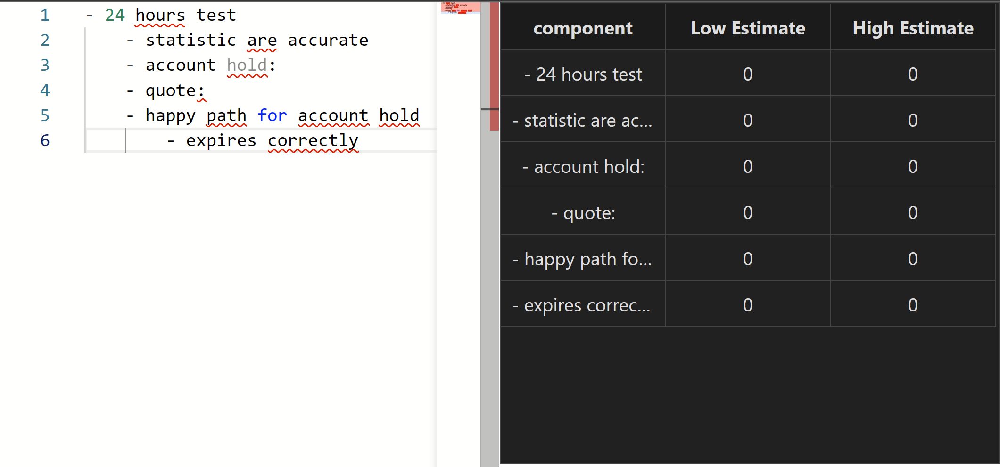

# Orbline
### is a orbis style outlining tool




## Features
- simple ui for editing outlines
- programmatic  spreadsheet generator
- powerful shortcuts

# install & development
```bash
pnpm install
pnpm run dev
```


# dev command log  (not to be followed)
```bash
pnpm install --save @monaco-editor/react
pnpm run dev
pnpm install --save react-data-grid
pnpm run dev
pnpm install --save styled-components
```


# libraries used
[@monaco-editor/react - npm](https://www.npmjs.com/package/@monaco-editor/react)
-      [demo Monaco Editor React](https://monaco-react.surenatoyan.com/)

# Links used
- [adazzle/react-data-grid: Feature-rich and customizable data grid React component](https://github.com/adazzle/react-data-grid#groupformatterprops)
- [react-data-grid/TreeView.tsx at main · adazzle/react-data-grid](https://github.com/adazzle/react-data-grid/blob/main/website/demos/TreeView.tsx)
- [adazzle/react-data-grid: Feature-rich and customizable data grid React component](https://github.com/adazzle/react-data-grid)
- [React Data Grid](https://adazzle.github.io/react-data-grid/#/tree-view)
- [suren-atoyan/monaco-react: Monaco Editor for React - use the monaco-editor in any React application without needing to use webpack (or rollup/parcel/etc) configuration files / plugins](https://github.com/suren-atoyan/monaco-react)
- [reactjs - Line two divs side by side with CSS and React - Stack Overflow](https://stackoverflow.com/questions/39702130/line-two-divs-side-by-side-with-css-and-react)
- [How to pass data from child component to its parent in ReactJS? - Stack Overflow](https://stackoverflow.com/questions/38394015/how-to-pass-data-from-child-component-to-its-parent-in-reactjs)
- [Can't resolve 'react/jsx-runtime' · Issue #2230 · adazzle/react-data-grid](https://github.com/adazzle/react-data-grid/issues/2230)
    revert to `7.0.0-canary.30`
